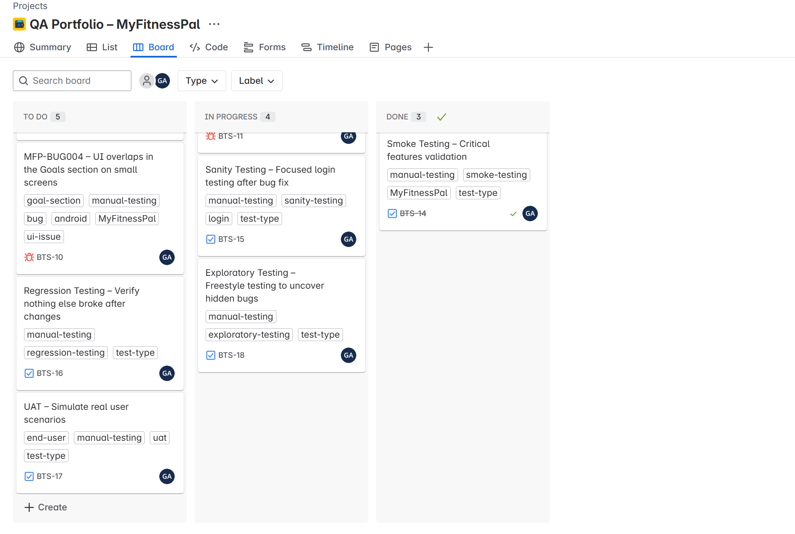

# MyFitnessPal Manual Testing Project

This project showcases a beginner-level manual testing simulation of the **MyFitnessPal mobile app**, focusing on common QA documentation deliverables.

The goal is to practice test case design, bug reporting, and basic validation steps for a health and fitness tracking app — mimicking real-world QA work in regulated environments like medical devices.

---

## Project Objectives

- Explore key features of the MyFitnessPal app
- Create formal test documentation
- Build a QA portfolio artifact suitable for entry-level testing roles

---

## Tested Features

- **Login & Authentication**  
- **Food Logging & Diary Management**  
- **Calorie Goal Setting**  
- **Daily Nutrition Summary**  
- **Water Intake Tracking**  

---

## Documentation

- [`MyFitnessPal_TestCases.docx`](./MyFitnessPal_TestCases.docx)  
  A formal set of 5 manually written test cases covering login, food logging, goal setting, and diary features. Each case includes preconditions, steps, expected results, and severity level.

- `BugReports_MyFitnessPal.docx` *(coming soon)*  
    Contains 5 detailed bug reports identified during manual testing. Each report includes environment, reproducibility, steps to reproduce, expected vs actual results, severity, priority, status, reporter, and date.

- `TestPlan_MyFitnessPal.docx` *(optional in future)*  
  May include scope, objectives, test strategy, environment, and risk-based testing focus.

  ## 🧾 JIRA-Based Test & Bug Management

As part of this QA project, I created and maintained a professional testing workflow using **JIRA Software**, simulating real-world processes in a medical or healthcare software environment.

### 🔹 JIRA Board Highlights

- 📌 Project Name: **QA Portfolio – MyFitnessPal**
- 🛠️ Managed 5 detailed **bug reports** with reproducible steps, severity, and environment info
- 🧪 Created 2 complete **manual test cases** for login and food logging features
- 🗂️ Used clear issue types (`Bug`, `Task`) and organized labels:
  - `bug`, `test-case`, `manual-testing`, `food-logging`, `login`, `android`, `iOS`, `ui-issue`
- 📊 Worked across all Jira workflow stages:  
  **To Do → In Progress → Done**

### 🖼️ Board Screenshot

> The image above shows how testing work was tracked and managed using a structured QA Kanban board.

---

## 🧪 Testing Types Covered in JIRA

This QA project includes documentation and issue tracking for five core testing types commonly used in manual software testing:

- **Smoke Testing** – Confirmed app stability by verifying core flows like login and diary access  
- **Sanity Testing** – Focused login flow tests after applying fixes  
- **Regression Testing** – Re-tested core modules to ensure recent changes didn’t break existing functionality  
- **User Acceptance Testing (UAT)** – Simulated a real user journey to validate product readiness  
- **Exploratory Testing** – Performed freestyle testing to discover hidden or edge-case issues

All testing types were tracked in JIRA using separate Task issues, proper labels, and a Kanban workflow (To Do → In Progress → Done).

### 🖼️ Board Screenshot

## Tools Used

- **Application Under Test**: MyFitnessPal v23.04.1 on Android and iOS  
- **Documentation**: Microsoft Word (.docx)  
- **Version Control**: GitHub  
- **Test Environment Examples**:  
  - Android 11 on Pixel 4  
  - iOS 15 on iPhone 12  

---

## Notes

This is a self-directed learning project and does not represent actual testing for MyFitnessPal. It is intended solely for QA practice and educational purposes.

---

## Author

- **Name**: **Ghazaleh Alizadehbirjandi**
- **LinkedIn**: https://www.linkedin.com/in/ghazaleh-alizadeh-a098181ba/
- **GitHub**: https://github.com/HazalAtis

